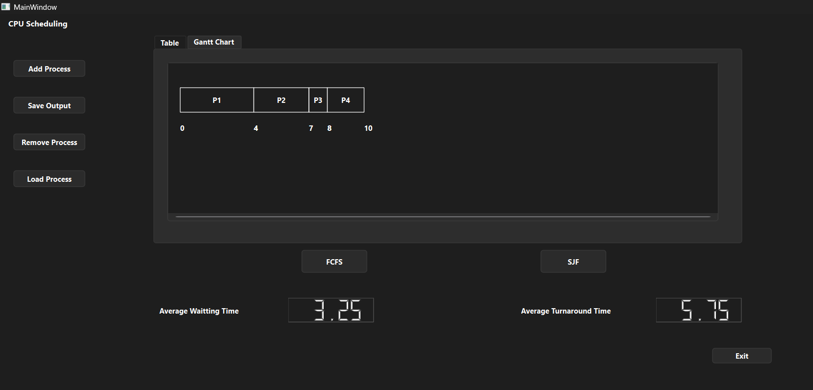
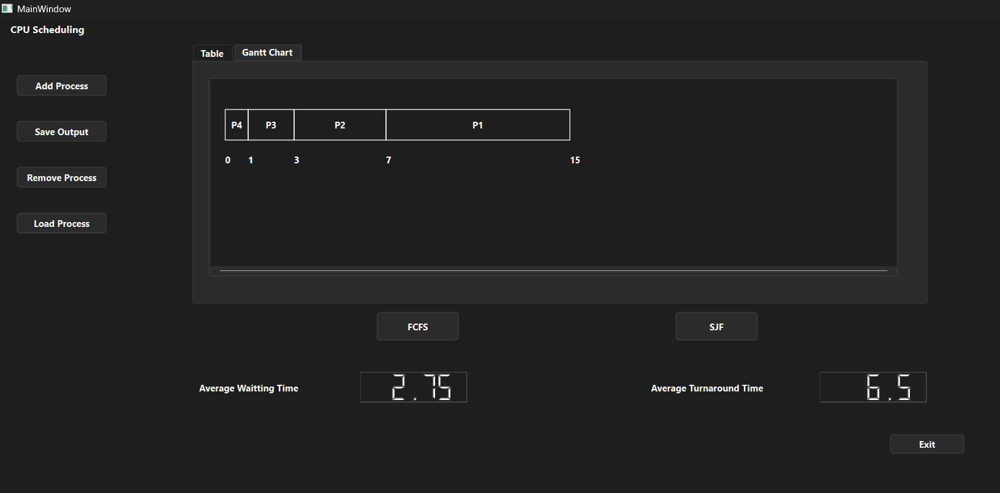

# 🖥️ CPU Scheduling Simulator   
(FCFS & Non-Preemptive SJF)
   
## 📌 Project Overview

This project is a desktop-based application developed by our group to simulate and visualize CPU scheduling algorithms, focusing on:   

- First Come First Serve (FCFS)   

- Shortest Job First (SJF – Non-preemptive)   

-> The application allows users to load process data from a CSV file, execute scheduling algorithms, and analyze the results through tables, Gantt charts, and performance metrics.
All results can be exported to CSV for verification with textbook formulas and reporting.   

## 📍 Main Feature    

- [x] Import process data from a CSV file
 
- [x] Add, remove, and manage processes in the application

- [x] Execute FCFS (First Come First Serve) scheduling algorithm

- [x] Execute SJF (Non-preemptive) scheduling algorithm

- [x] Display scheduling results in a process table

- [x] Visualize CPU execution using a Gantt Chart

- [x] Calculate:   

- Start Time

- Completion Time
   
- Turnaround Time
  
- Waiting Time

- Average Waiting Time

- Average Turnaround Time

- Export detailed simulation results to a CSV file

- [x] Support stress testing and performance evaluation

## 📄 Related Files   

##  ⚙️ How to run  

### Step 1 - Launch the application
#### 🛠️ Requirements   
For Windows
- Windows 10+   

- Qt 6.x (MinGW or MSVC)   

- CMake 3.16+   

- MinGW / Visual Studio

[Download CPU Scheduling](https://github.com/huynhtu30082006-alt/Operating_System_Project/releases/download/Release/Desktop_Qt_6_10_1_MinGW_64_bit-Release.zip) and run the executable file.

### Step 2 - Download CSV File   
- Clone or [Download](https://github.com/huynhtu30082006-alt/Operating_System_Project/tree/main/data) this repository to your computer. 
- Click `Add Process` Button in GUI to choose a CSV file to add the program.

### Step 3 - Run scheduling Algorithms 

- Click `FCFS` or `SJF` Button to start calculate.   

- The table and Gantt chart will be updated with the result.

### Step 4 - Save result

- Click `Save Output` Button.   

- The detailed result included: State, result of algorithms user choose before will be saved as a CSV file in the output folder.

Step 5 - Exit the program
- Press `Exit` to confirm ending the program.

## 📝 Note 
- You can use `Load Process` to reload a previously saved CSV result file. The result will only display the state and results corresponding to the last algorithm you ran before saving.
- The user can select any process from the output table to delete, or select no processes and click `Remove Process` to delete all processes.

## 📬 Input (CSV file)   

The application uses a CSV file as input to define the list of processes for CPU scheduling simulation.    

### Column Information 
Each input CSV file will have a standard structure consisting of 3 columns:   

| Column | Description |
| ------------ | ------------------------------------------------ |
| Process | Unique name or ID of the process |
| Arrival | Time when the process arrives in the ready queue |
| Burst  | The time required for the CPU to execute a process |   

### Example   
Process,Arrival,Burst   
P1,0,5   
P2,2,3   
P3,4,1   

> In this Example, In this example, P1 arrives at the queue at approximately time 0 and it takes 5 units of time for the CPU to complete the process, P2 arrive at 2 after P1 and need 3 units of time to complete, etc..

## 🖥️ Output (On Screen and On CSV File)   
### On Screen Output   
The display result is calculated using an algorithm after inputting the data in 2 tab:   

### 1️⃣ Table Tab   
The results are stored and displayed as a table with 8 columns, including 3 columns for input information and the remaining 5 columns containing calculated information such as:   

| Column | Description |
| ------------ | ------------------------------------------------ |
| Start | The time it takes for the program to be loaded into the CPU and begin running |
| Completion | Time the process finishes |
| Turnaround | The total time a process exists in the system |  
| Waiting | The total time a process exists in the system |
| Response | The time from when a process arrives until it is first processed by the CPU |  

### 2️⃣ Gantt Chart Tab   
The application displays a Gantt chart to visualize how CPU resources are allocated to each process over time.   

Each cell in the Gantt chart represents a process being executed by the CPU, and the length of each cell indicates the unit of time each process needs to execute. Labels inside each cell indicate the process ID, while the numbers below show the start and end times of each execution segment.   

Gantt charts allow users to:   

- Observe the execution order of processes.   

- Examine the scheduling behavior of FCFS and SJF (non-priority).   

- Visualize timeout and completion time calculations.

> Additionally, the GUI supports calculating `Average Waiting Time` and `Average Turnaround Time` to help users easily evaluate and gain a clearer understanding of the advantages and disadvantages of each algorithm.

### Exported Output (CSV File)   
After performing the calculations and printing the results to the screen, the application can export the results to a CSV file in the output folder.   

The output CSV file contains detailed scheduling results for each process, with saved information including the results of the 8 columns in On Screen Output.
   
> This CSV file can be used to verify the correctness of the scheduling result and to compare with textbook examples.

## 🧪 Testing & Verification   

- [x] To verify the correctness and performance of the CPU Scheduling application, we tested the system using various CSV input scenarios. These test cases were designed to validate both the FCFS and SJF (non-preferred) algorithms under normal and special conditions.   

> The correctness of the simulation was verified by manually calculating the scheduling results according to the definitions of FCFS and SJF in the operating systems textbook, and comparing them with the output produced by the application.

### 1️⃣ [Basic Text Book Case](https://raw.githubusercontent.com/huynhtu30082006-alt/Operating_System_Project/main/data/basic_test.csv)   

#### Input
Process,Arrival,Burst      
P1,0,4   
P2,1,3   
P3,2,1   
P4,3,2   

#### Purpose   
This case is used to compare the application output with standard textbook examples.   
   
#### Original formula   

For any process `i`:   

- `Start Time[i] = max(Completion Time of previous process, Arrival Time[i])`.

- `Completion Time[i] = Start Time[i] + Burst Time[i]`.
    
- `Turnaround Time[i] = Completion Time[i] - Arrival Time[i]`.

- `Waiting Time[i] = Turnaround Time[i] - Burst Time[i]`.

- `Response Time[i] = Start Time[i] - Arrival Time[i]`.

- `Average Waiting Time = (Total Waiting Time Of All Process) / n ( with n is the number of process)`.   
   
- `Average Turnaround Time = (Total Turnaround Time Of All Process) / n`.   

#### Expected behavior   
- FCFS

🗓️ Table   

| PID | Arrival | Burst | Start | Completion | Turnaround | Waiting | Response |
| --- | --- | ----- | ----- | ------ | ---- | ---------- | --------- |   
| P1 | 0 | 4 | 0 | 4 | 4 | 0 | 0 |
| P2 | 1 | 3 | 4 | 7 | 6 | 3 | 3 |  
| P3 | 2 | 1 | 7 | 8 | 6 | 5 | 5 |
| P4 | 3 | 2 | 8 | 10 | 7 | 5 | 5 |   

**Figure 1 – Result FCFS Table of Basic Test screenshot**  

📊 Gantt   

0 ── P1 ── 4 ── P2 ── 7 ─ P3 ─ 8 ── P4 ── 10   

Average Waiting Time = 3.25    
Average Turnaround Time = 5.75     

**Figure 2 – Result FCFS Gantt Chart of Basic Test screenshot**  

- SJF

🗓️ Table   

| PID | Arrival | Burst | Start | Completion | Turnaround | Waiting | Response |
| --- | --- | ----- | ----- | ------ | ---- | ---------- | --------- |   
| P1 | 0 | 4 | 0 | 4 | 4 | 0 | 0 |   
| P3 | 2 | 1 | 4 | 5 | 3 | 2 | 2 |
| P4 | 3 | 2 | 5 | 7 | 4 | 2 | 2 | 
| P2 | 1 | 3 | 7 | 10 | 9 | 6 | 6 |   

**Figure 3 – Result SJF Table of Basic Test screenshot**  
      

📊 Gantt   

0 ── P1 ── 4 ── P3 ── 5 ─ P4 ─ 7 ── P2 ── 10   

Average Waiting Time = 2.5      
Average Turnaround Time = 5     

**Figure 4 – Result SJF Gantt Chart of Basic Test screenshot**  
 

### 2️⃣ [Long Job Case](https://raw.githubusercontent.com/huynhtu30082006-alt/Operating_System_Project/main/data/long_job.csv)   

#### Input
Process,Arrival,Burst         
P1,0,10   
P2,1,1   
P3,2,1   
P4,3,1      

#### Purpose   
This test case demonstrates the convoy effect in FCFS scheduling, where a long process arriving first causes shorter processes to experience long waiting times.
The same input is also used to compare the performance of FCFS and non-preemptive SJF.   

In this test case, FCFS and non-preemptive SJF produce identical results because the long process arrives first and cannot be preempted.
Shorter processes arrive while the CPU is busy and must wait until the current process completes.

#### Expected behavior (Same Output)   

🗓️ Table  

| PID | Arrival | Burst | Start | Completion | Turnaround | Waiting | Response |
| --- | --- | ----- | ----- | ------ | ---- | ---------- | --------- |   
| P1 | 0 | 10 | 0 | 10 | 10 | 0 | 0 |
| P2 | 1 | 1 | 10 | 11 | 10 | 9 | 9 |  
| P3 | 2 | 1 | 11 | 12 | 10 | 9 | 9 |
| P4 | 3 | 1 | 12 | 13 | 10 | 9 | 9 |  

📊 Gantt   

0 ── P1 ── 10 ── P2 ── 11 ─ P3 ─ 12 ── P4 ── 13    

Average Waiting Time = 6.75      
Average Turnaround Time = 10   

### 3️⃣ [Same Arrival Time Case](https://raw.githubusercontent.comhuynhtu30082006-alt/Operating_System_Project/main/data/same_arrival_time.csv)      
   
#### Input   
Process,Arrival,Burst    
P1,0,8   
P2,0,4   
P3,0,2   
P4,0,1   

#### Purpose    
Check the processing order when the Arrival Time of all Processes is equal.   
      
#### Expected behavior   
- FCFS

🗓️ Table   

| PID | Arrival | Burst | Start | Completion | Turnaround | Waiting | Response |
| --- | --- | ----- | ----- | ------ | ---- | ---------- | --------- |   
| P1 | 0 | 8 | 0 | 8 | 8 | 0 | 0 |
| P2 | 0 | 4 | 8 | 12 | 12 | 8 | 8 |  
| P3 | 0 | 2 | 12 | 14 | 14 | 12 | 12 |
| P4 | 0 | 1 | 14 | 15 | 15 | 14 | 14 |  

**Figure 5 – Result FCFS Table of Same Arrival Time test screenshot**  
    

📊 Gantt   

0 ── P1 ── 8 ── P2 ── 12 ─ P3 ─ 14 ── P4 ── 15      

Average Waiting Time = 8.5    
Average Turnaround Time = 12.25   

**Figure 6 – Result FCFS Gantt Chart of Same Arrival Time test screenshot**  
        

- SJF

🗓️ Table   

| PID | Arrival | Burst | Start | Completion | Turnaround | Waiting | Response |
| --- | --- | ----- | ----- | ------ | ---- | ---------- | --------- |  
| P4 | 0 | 1 | 0 | 1 | 1 | 0 | 0 |      
| P3 | 0 | 2 | 1 | 3 | 3 | 1 | 1 |       
| P2 | 0 | 4 | 3 | 7 | 7 | 3 | 3 |   
| P1 | 0 | 8 | 7 | 15 | 15 | 7 | 7 |    

**Figure 7 – Result SJF Table of Same Arrival Time test screenshot**  
    
   
📊 Gantt   

0 ── P4 ── 1 ── P3 ── 3 ─ P2 ─ 7 ── P1 ── 15            

Average Waiting Time = 2.75       
Average Turnaround Time = 6.5              

**Figure 8 – Result FCFS Gantt Chart of Same Arrival Time test screenshot**  
    

### 4️⃣ [IDLE Case](https://raw.githubusercontent.com/huynhtu30082006-alt/Operating_System_Project/main/data/idle_cpu.csv)   

#### Input   
Process,Arrival,Burst       
P1,0,3   
P2,6,4   
P3,7,2     

#### Purpose    
This test case verifies correct handling of CPU idle periods when no process is available in the ready queue.   

The scheduler must wait until the next process arrives instead of executing prematurely.     
      
#### Expected behavior (Same Result)   

🗓️ Table   

| PID | Arrival | Burst | Start | Completion | Turnaround | Waiting | Response |
| --- | --- | ----- | ----- | ------ | ---- | ---------- | --------- |   
| P1 | 0 | 3 | 0 | 3 | 3 | 0 | 0 |
| P2 | 6 | 4 | 6 | 10 | 4 | 0 | 0 |     
| P3 | 7 | 2 | 10 | 12 | 5 | 3 | 3 |  

📊 Gantt   

0 ── P1 ── 3 ── IDLE ── 6 ── P2 ── 10 ─ P3 ─ 12       

Average Waiting Time = 1          
Average Turnaround Time = 4          

## 👥Group Work and Task Distribution

Team Member’s Contributions
### 👤 Triệu — CSV & Data Handling

Triệu was responsible for designing and implementing the data input/output module using CSV files.

#### Main tasks:

- Implement a module to read process data from CSV files

- Validate input files and handle errors (missing file, invalid format, incorrect data)

- Export scheduling results to output CSV files

- Create test datasets with different sizes to evaluate correctness and scalability

- Test datasets:

Small test: 2–3 processes

Medium test: 5–7 processes

Large test: 20–50 processes

- Related files:

`IO.h`

`IO.cpp`

CSV test input files

This module provides reusable and reliable data processing for all scheduling algorithms.

### 👤 Thư — FCFS Scheduling Algorithm

Thư was responsible for implementing the First Come First Serve (FCFS) scheduling algorithm.

#### Main tasks:

- Implement the FCFS algorithm according to operating system theory

- Calculate key metrics:

- Waiting Time

- Turnaround Time

- Completion Time

- Verify correctness by comparing results with textbook examples

Implementation location:

`algorithms.h`

### 👤 Linh — SJF (Non-preemptive) Scheduling Algorithm

Linh was responsible for implementing the Shortest Job First (Non-preemptive) scheduling algorithm.

#### Main tasks:

- Implement the non-preemptive SJF algorithm

- Design test cases with different arrival times

- Validate and compare results to ensure correctness

- Implementation location:

`algorithms.h`

### 👤 Tú — Gantt Chart & User Interface

Tú was responsible for result visualization and user interface development.

#### Main tasks:

- Draw Gantt charts (initially in console, later integrated into the GUI)

- Display formatted and readable process result tables

- Design and implement the GUI using Qt

- This component allows users to visually analyze scheduling behavior and compare algorithm performance.

- Program Workflow

- The user launches the application using Qt Creator

 - A CSV file containing process data is selected

- The program reads and validates the input data

- A scheduling algorithm (FCFS or SJF) is applied

- Results are displayed:

Process information table

Gantt chart visualization

Results are exported to a CSV output file

Additional Notes

The project follows Object-Oriented Programming (OOP) principles

Responsibilities are clearly separated into data processing, algorithms, and user interface.   

> All contributions are tracked using Git version control. Individual contributions can be verified through the Git commit history.

   

 

